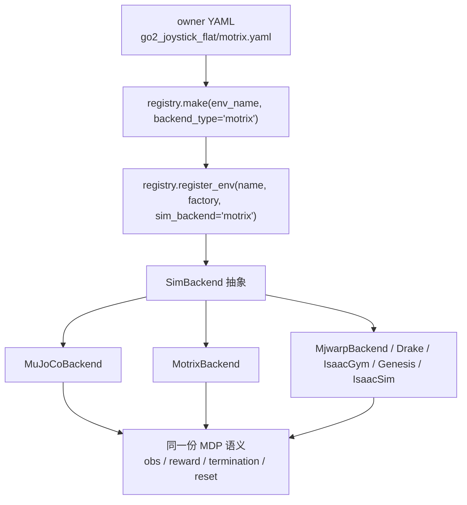

# UniLab 深度分析 与 motrixsim 移植评估

> ## ⛔ 本方案已搁置（2026-09-13 用户裁决）
>
> **决定**：**删除第二物理后端（motrixsim）的接入规划**，路线改为**先把 mjlab + MuJoCo 这一套做精**。
> 本文转为**方法论来源**保留，不再作为待办：
>
> * **已抽出并已落地**（这些与后端无关，是通用基础设施，**继续保留**）：
>   「后端能力契约」→ K2（`adapters/backend_adapter.py` 能力表，fail-closed）；
>   「跨端一致性契约守卫」→ K3（`backend/contract_adjudicator.py`，一次实现两处复用）；
>   「注册表显式化」→ K4（`registry/skills/index.json`）。
> * **已随裁决删除**：K5–K8（`adapters/motrix/` 适配层 / 13 机型移植回归 / 跨引擎门禁 / 可选第三后端）。
>   `adapters/backend_adapter.py` 的 `BACKEND_DESCRIPTORS` / `BACKEND_CAPABILITIES` 已移除 motrixsim 条目
>   （不留"规划中"的幽灵后端）。
> * **取证留存**：`tools/probe_motrixsim.py`（14/14 包 MJCF 可加载 + step）**不属于任何里程碑**；
>   若将来重评第二后端，这份结论可直接复用。
> * **重评前提**（建议）：产品内「训练→导出→入库」闭环先跑通（B9/B10），否则跨引擎对照只能拿上游策略做样本。
>
> 下文为决策当时的完整分析，保留原样不改写历史。

> **日期**：2026-09-13 ｜ **产品版本**：0.51.0 ｜ **对应 Issue**：#31（重构）
> **取证底座**：[`00_resources/unilab_new/UniLab/`](../../00_resources/unilab_new/UniLab/)（1131 文件 / 8.1 MB，Apache-2.0，上游 `github.com/unilabsim/UniLab`）
> **分析范围**：源码（`src/unilab` 285 py / 78063 行）+ 配置（187 yaml）+ 文档（248 md，含 6 篇 ADR）+ 测试（215 py / 63219 行）
> **结论先行**：**「保留 mjlab 技术栈 + 只移植 UniLab 的 motrixsim 部分（不移植 Unilab 本体）」可行，且是本仓库当前性价比最高的后端扩展路径**——要移植的**不是** `src/unilab`，而是**「后端能力契约 + sim2sim 契约守卫 + MotrixBackend 适配层」三块**。见 §5。
>
> ⚠️ **2026-09-13 实测修订（推翻本文初稿的三条阻塞性判断）**：初稿假定 `motrixsim-core` 不可安装、Windows 不支持、无法实跑，因此把 T4 判为「被外部依赖阻塞」。**实测全部不成立**：
> 1. **可安装**：PyPI 有 `motrixsim-core`（0.8.0 / 0.8.1 / 0.8.2 / 0.9.0 / 0.10.0），本机 cp311 manylinux 轮子 52 MB，`pip install` 成功、`import motrixsim` 成功。
> 2. **三平台轮子齐备**：`win_amd64`（40.4 MB）、`macosx_11_0_arm64`（47.1 MB）、`manylinux_2_17/2014 x86_64` 均在 PyPI；METADATA 显式 `Classifier: Operating System :: Microsoft Windows`——**R2「Windows 支持未确认」作废**。
> 3. **MJCF 兼容性实证通过**：本仓库 **14/14 包** `model/robot.xml` 在 motrixsim 下 `load_model` + 5 步 `step` 全部成功（`tools/probe_motrixsim.py`，可复现）。R3 的「需逐模型验证」已一次性验证完。
> 4. **许可已澄清**：轮子内 `LICENSE` 与 METADATA 均为 **Apache-2.0**（`License: Apache-2.0`），非「闭源不可分发」——**R6 降级**。
>
> 结论变化：**T4 不再被阻塞，M2 可提前**；风险表 R1/R2/R3/R6 全部下调，新增的真实风险改为「闭源二进制不可静态审计 + 版本锁 + 资产体积」。

---

## 1. UniLab 是什么（一句话与定位）

> **UniLab = 一次「异构 RL 运行时」的工程解**：把**物理仿真放在 CPU**（多进程/多后端），把**策略学习放在 GPU**，两者通过**共享内存零拷贝**流式传 transition。它不是一个新算法，而是一条**运行时管线 + 契约体系**。

上游自述（`README_zh.md`）：

```
┌────────────────────┐                            ┌─────────────────────────┐
│   Uni Physics Sim  │   Unified Shared Memory    │   GPU Policy Training   │
│   Motrix / MuJoCo  │ ─────────────────────────▶ │     PPO / SAC / TD3     │
│   MjWarp / Drake   │    SharedReplayBuffer      │ CUDA / MPS / ROCm / XPU │
└────────────────────┘                            └─────────────────────────┘
```

**它的存在理由**：`mjlab` / IsaacLab / IsaacGym 这些主流栈，把物理仿真也压到 GPU 上（warp/PhysX），于是：
- 想训练就得有一块（甚至多块）NVIDIA GPU，**仿真与学习争抢同一张卡**；
- 后端被焊死在 CUDA 生态，**跨平台（macOS / ROCm / Intel XPU）基本无解**；
- 换一个物理引擎 = 换一套训练框架，**任务配置无法复用**。

UniLab 的答案是：**物理引擎是可替换的 CPU 后端（通过 `SimBackend` 抽象），学习器是可替换的加速器侧 runner，任务配置是 owner YAML**。这也是它对我们最有价值的一点——**它的后端抽象是「跨引擎」的，而 mjlab 的后端抽象是「mjwarp 单引擎内部」的**。

**体量对照**：

| 维度 | 数量 |
|---|---|
| Python 源码 | 285 文件 / 78063 行 |
| 测试 | 215 文件 / 63219 行（测试:源码 ≈ 0.81，工程纪律强） |
| Hydra 配置 | 187 yaml（`conf/{ppo,appo,sac,td3,flashsac,ppo_him,hora_distill}/task/<task>/<backend>.yaml`） |
| 文档 | 248 md（含 **6 篇 ADR**，均带 Context/Decision/Consequences/Alternatives/Evidence） |
| 机器人资产 | 16 机型（go1/go2/go2w/a2/go2_arm/g1/g1_23dof/t800/x2/microduck/stewart/allegro/sharpa…） |
| 任务 | locomotion / motion_tracking / manipulation / manip_loco 四大族，40+ 具体任务 |
| 物理后端 | **7 个**：mujoco / **motrix** / mjwarp / drake / isaacgym / isaacsim / genesis |
| 算法 | PPO / APPO / SAC / FastSAC / FlashSAC / TD3 / FastTD3 / **HORA 蒸馏** / **HIM-PPO** |
| 许可 | Apache-2.0（**可安全吸收，须保留版权声明**） |

---

## 2. 架构解构：它到底怎么分层的

### 2.1 三层运行时 + 五层代码边界

```
L4 Scripts        scripts/ + cli.py            ← 只做装配，不含业务规则
L3 Algo & IPC     algos/ + ipc/                ← learner / runner / buffer / 权重同步
L2 Config&Registry conf/ + registry.py         ← Hydra compose + owner YAML + 注册
L1 Env            envs/ + base/np_env.py       ← MDP 语义、观测、奖励、reset
L0 Backend        base/backend/                ← SimBackend 抽象 + 物理引擎实现
                  ▲
                  单向依赖：backend → env → config/registry → algo/ipc → scripts
```

这条**单向依赖律**写在 ADR-0001，且**明文禁止**：脚本层承载长期业务规则、backend 私有行为散落到脚本分支。

### 2.2 两种运行时形态（这是它最核心的工程贡献）

**① 同步 PPO 路径**：单进程，`registry.make()` 造 env → 同进程 learner；单机多卡时一卡一进程复制 env/policy/rollout，**复用 RSL-RL 的梯度平均协议**（不另建同步协议）。

**② 异步 APPO / off-policy 路径**：

```
CPU physics env loop ──► shared IPC buffer ──► learner (GPU)
        ▲                                            │
        └────────────── SharedWeightSync ◄───────────┘
```

- `AsyncRunner` 负责 collector 进程启动/停止与共享资源清理；
- `RolloutRingBuffer`（APPO）/ `ReplayBuffer`（off-policy）提供有界 host ingress；
- `SharedWeightSync` 发布 actor 权重。

**目录证据**：`ipc/{async_runner,rollout_ring_buffer,replay_buffer,weight_sync,shared_buffer,dp_launcher,memory_budget}.py`。

> **对我方的意义**：Legged Studio 当前的训练栈是「隔离子进程 + JSON 协议」——**进程级隔离**，样本全部序列化。UniLab 的**共享内存零拷贝**是另一条路：训练吞吐量级提升，但复杂度上升。**短期不移植，中期可评估**（见 §5.5）。

### 2.3 3 份核心契约（一切改动都要先问「这动了哪个契约」）

| 契约 | 文件 | 内容 |
|---|---|---|
| **Backend 契约** | `base/backend/base.py`（1098 行） | `SimBackend` 抽象：base/dof/body 状态、具名 sensor、`set_state`、物理 stepping、DR hook、可选 playback/render。**可选能力显式声明**：`BackendPlayCapabilities`、`BackendHeightScanner`、`get_dr_capabilities()`；不支持则抛 `NotImplementedError` |
| **Env 契约** | `base/np_env.py`（608 行）+ ADR-0005 | `NpEnvState.obs: dict[str, np.ndarray]`；**仅两层**——`obs`（必选，actor）+ `critic`（可选）；**`privileged` 被明令废除**；第三方（RSL-RL）的历史字段名只允许在 adapter 边界映射 |
| **Task owner 契约** | `conf/<algo>/task/<task>/<backend>.yaml` + ADR-0003 | **一个 backend = 一份 owner YAML**；`training.sim_backend` 是**身份字段**不是开关；禁止单独 override 切后端 |

**这三份契约的写法**（尤其 ADR-0005 那句「**运行时不再承认 `privileged` 是 observation contract 的一部分**」）——是「契约即宪法」的范本，直接对应我们 §6 的价值观沉淀。

### 2.4 后端能力边界（ADR-0002，最值得抄的一篇）

> **「允许 backend 在能力上不对等，不要求 feature parity。」**

它把 MuJoCo 与 Motrix 的差异**显式建模为 capability**，而不是「同功能不同实现」：

| 能力 | MuJoCo | Motrix |
|---|---|---|
| 物理快照驱动的视频导出 | ✅ | ❌（用交互式 renderer） |
| 原生交互式渲染 | 部分 | ✅ |
| 原生视频录制 | ✅ | ✅（`--render-mode record`） |
| 地形扫描 | ✅ | ✅（`mtx.TerrainScanner`） |

**后果声明**：「评审时不再以『是否与 MuJoCo 完全一致』作为验收标准」。这句话直接解决我们「多后端接入后如何验收」的路线之争——**按能力验收，不按行为一致验收**。

### 2.5 任务组织：双轨制（值得注意的落地演进）

UniLab 的配置权威在 **Hydra owner YAML**（`conf/`），但源码 `tasks/` 里同时存在 Python 任务实现，呈现**两代组织方式的并存**：

- **全声明式（新）**：`tasks/motion_tracking/g1/__init__.py` —— 一个 for 循环批量 `registry.register_env_config(name, ManagerBasedRlEnvCfg)` + `registry.register_env(name, make_manager_based_rl_env, sim_backend="mujoco"/"motrix")`，**任务语义全部在 YAML 的 manager/term/callable 里**（`_target_` + dotted callable）。
- **Python 专属 term（旧/兜底）**：`tasks/locomotion/go2/footstand.py`、`tasks/locomotion/common/*` —— 属于「共享 MDP 库」，被 YAML 引用。

**这就是我们 `registry/skills/*.json` + `adapters/mjlab/shared_rewards.py` 的成熟版**：UniLab 把 term 的 callable 引用也做成了配置（`_target_` + dotted path + `CONFIG_MAPPING_POLICY_KEY` 元数据标记），**配置里不内联代码**，与我们的六条不变量第 2 条完全同构。

### 2.6 注册仍是显式清单（ADR-0004，对我们有直接警示）

```python
# src/unilab/tasks/__init__.py
__unilab_registry_modules__ = (
    "unilab.tasks.locomotion.go1", "unilab.tasks.locomotion.go2", ...
)
```

> **Bootstrap 入口 `ensure_registries()` 只导入显式声明的模块，不靠目录扫描。**

理由写在 ADR 里：目录扫描会让「注册契约被文件系统布局隐式决定」，且「导入失败边界不清晰」（分不清「缺 optional 包」与「契约被破坏」）。

**警示**：我们 `registry/skills/` + `adapters/mjlab/recipe_registry.py` 目前是**目录读取**，与 ADR-0004 的结论相反。可选包变多后会出现同类问题，建议记入待办（§7）。

### 2.7 DR 契约（独立成模块，而非散落在 manager）

`dr/{manager,provider,types,dr_utils}.py` —— DR 的 init/reset/interval 三段被抽成**独立契约**（ADR 之外的 `2-contracts/4-dr_contract.md`），`IntervalRandomizationPlan` / `ResetRandomizationPayload` / `DomainRandomizationCapabilities` 是数据类型。**Motrix 与 MuJoCo 各自实现同一 DR 契约**，这是「跨后端 DR 一致性」的前提。

---

## 3. motrixsim 专项解剖（移植目标）

### 3.1 它是什么

| 项 | 值 |
|---|---|
| 包名 | `motrixsim-core==0.8.2`（**Python 二进制包**，非源码） |
| 来源 | Motphys 团队，`https://motrixsim.readthedocs.io/` |
| 定位 | 机器人 / 具身智能物理仿真引擎 |
| 引入方式 | `uv sync --extra motrix` / `make setup-motrix`（**可选 extra，不装即不可用**） |
| 上游性质 | Motphys 商业团队发行；**运行时是 Rust 编译的闭源二进制**（无源码可审计），但**许可为 Apache-2.0**、PyPI 公开发布 |
| 平台 | 三平台轮子齐备：`manylinux_2_17/2014 x86_64`、`win_amd64`、`macosx_11_0_arm64`（cp311） |

**本次实测结论（2026-09-13）**：`pip install motrixsim-core==0.8.2` 成功、`import motrixsim` 成功、**本仓库 14/14 包 MJCF 加载 + step 全部通过**（`tools/probe_motrixsim.py --all`）。唯一真实的硬约束是**运行时不可静态审计**（无源码），而非「装不上 / 平台不支持」。

### 3.2 适配层构成（要移植的真实对象）

| 文件 | 行数 | 职责 |
|---|---:|---|
| `base/backend/motrix/backend.py` | 1814 | `MotrixBackend(SimBackend)`：场景构建、step、sensor 读取、DR、playback |
| `base/backend/motrix/scene.py` | 333 | MJCF→Motrix 的 `SceneModel` 物化、fragment/keyframe 注入、hfield/传感器挂载 |
| `base/backend/motrix/playback.py` | 96 | `run_motrix_playback` 交互式回放 |
| `base/backend/motrix_camera.py` | 102 | 追踪相机（`MotrixTrackingCamera` / `render_offsets` / `tracking_camera_lookat`） |
| `base/backend/motrix/__init__.py` | 35 | **懒加载门面**：`MOTRIX_AVAILABLE` 探测 + 属性代理 |
| **合计** | **~2380** | 全部为**纯增量**，不侵入 mujoco 路径 |

**依赖面（关键发现）**：

```python
# backend.py
try:
    import motrixsim as mtx
    from motrixsim.render import RenderApp, RenderSettings
    from motrixsim.render import RenderClosedError
    MOTRIX_AVAILABLE = True
except ImportError:
    MOTRIX_AVAILABLE = False
```

实际用到的 API 面**很窄**（全仓 grep 统计）：`mtx.SceneModel` / `SceneData` / `Link` / `Body` / `Geom` / `GeomHField` / `PositionActuator` / `TerrainScanner` / `msd.from_file` / `render.RenderApp`。

> **这意味着「移植适配层」不是「移植一个引擎」，而是「对接约 10 个类 + 1 个渲染入口」。** 若目标仓库的引擎不同（如 MJX / Genesis），只需另写一份同构适配器——**这正是我们想要的能力**。

### 3.3 它是如何做到「一套任务跑两个引擎」的



**要点**：

1. **任务与引擎解耦**：`@registry.env(name, sim_backend=...)` 为同一 env 注册**多个**后端工厂，`EnvMeta.env_factory_dict: {backend → factory}`。
2. **能力不对等由 capability 声明**，不是脚本 if-else（ADR-0002）。
3. **跨后端契约由 `utils/sim2sim.py` 守卫**（见 §3.4）。
4. **配置差异在 owner YAML 层显式写出**（ADR-0003），不是运行时推断。

### 3.4 sim2sim 跨后端契约守卫（最有移植价值的一块）

`src/unilab/utils/sim2sim.py`（~260 行）+ `training/sim2sim.py`：

```python
ALLOWLIST     = ["training.sim_backend", "env.scene", "training.play_steps",
                 "env.domain_rand", "env.noise_config", "env.commands.vel_limit"]
WARNING_LIST  = ["reward.scales", "reward.base_height_target", "env.ctrl_dt", ...]
DENYLIST      = ["algo.obs_groups", "env.control_config.action_scale", "env.observations",
                 "env.actions", "env.policy_observation_group", "env.critic_observation_group",
                 "algo.policy.actor_hidden_dims", "algo.policy.critic_hidden_dims",
                 "algo.empirical_normalization", "env.commands.motion.params.sampling_mode"]
```

**机制**：
- 训练时把 DENYLIST+WARNING_LIST 写成 `contract_snapshot` 存进 `run_dir/run_config.json`；
- 跨后端 play 时 `resolve_sim2sim_config(source_run_dir, target_cfg, strict=True)` 逐字段比对；
- **不对称出现一律 fail-closed**（`ENV_STRUCTURAL_DENYLIST`）；
- 不一致 → `CrossBackendIncompatibleError`，报错文本给出「哪个字段、源值、目标值、以及怎么修」；
- 另有 `policy_load_dim_guard()`：把「checkpoint 与 env 维度不匹配」翻译成可读诊断。

**上游现状（可对照我们的 DENYLIST gate）**：

- 对每个 task 用 Hydra `compose` 展开后**只读比对**，脚本 `scripts/audit_sim2sim_contracts.py`，结果公开成文档（`9-sim2sim_contract_status.md`）；
- 判定三档 ✅可迁移 / ❌阻断 / ⚪N/A；
- **实测约一半 task 是 ❌**，分歧集中在 `empirical_normalization`、`obs_groups`、`action_scale`、`sampling_mode`；
- 文档还给出**「怎么把 BLOCKED 变可迁移」**的字段级指引（哪些能只改 YAML、哪些改值必须重训）。

> **这是 SIM2SIM 的「跨后端」版**：我们现在的 `export_gate.DENYLIST` 是**训练侧→部署侧**（ONNX 出图前）的门禁；UniLab 的是**训练侧→另一个引擎的回放**的门禁。**两者可以合并成一个统一的「契约快照 + 逐字段裁决」机制**（§5.3）。

### 3.5 motrix 的已知边界与坑

| 项 | 事实 | 影响 |
|---|---|---|
| 无源码（**唯一真·硬约束**） | Rust 编译的 `.so` 二进制；`00_resources` 无内核 | **无法静态审计**，只能靠上游文档 + 接口行为；升级需回归 |
| 版本迭代快 | PyPI 已有 0.8.0→0.10.0 五个版本 | 必须**锁版本**（`==0.8.2`，与 UniLab 对齐）；API 面每年可能变 |
| 渲染闭环语义 | 自定义 `RenderClosedError` → 在接口边界翻译为 UniLab 的 `RenderClosedError`（已核实 `motrixsim.render.RenderClosedError` 存在） | 渲染窗口关闭是常态，play loop 必须按类型捕获而非错误名匹配 |
| `<keyframe>` 校验 | Motrix 的 `msd.from_file` 会校验 keyframe qpos，而 fragment XML 只带 sensor/contact | UniLab 写了 `_materialize_robot_with_fragment_keyframes()` 做临时注入；**我方 14 包实测均无此问题** |
| MJCF 子集 | 走 `motrixsim.msd`（自有 msd 层）而非 MuJoCo 解析器 | **MJCF 兼容性 ≠ MuJoCo 语义**（能加载 ≠ 动力学一致）；**加载兼容已 14/14 验证**，动力学一致性仍需 sim2sim 对照 |
| 地形 | 有 `TerrainScanner` + `GeomHField`（均已核实存在），与 MuJoCo hfield 语义需对齐 | `terrain_gen`（ArenaX 移植）产出 MJCF hfield，需验证可被消费 |

**实测 API 面（与 UniLab 用量逐项比对，全部命中）**：`SceneModel / SceneData / Link / Body / Geom / GeomHField / PositionActuator / TerrainScanner / msd / step / load_model / render.{RenderApp,RenderSettings,RenderClosedError}`。UniLab `backend.py` 实际只用到 `mtx.Link/Body/Geom/GeomHField/PositionActuator/SceneData/SceneModel/TerrainScanner` 八类——**印证 §3.2「不是移植引擎，是对接约 10 个类」**。

---

## 4. 与 Legged Studio 的对照（逐维度）

| 维度 | Legged Studio 现状 | UniLab | 差距性质 |
|---|---|---|---|
| **定位** | 桌面/Web 工作台，覆盖「资产→训练→导出→sim2sim→部署」全流程 | 纯训练框架（CLI + Python API，无 UI） | **互补，非竞争** |
| **后端抽象** | `BackendAdapter` Protocol（env/runner/exporter 三入口），**仅 mjlab 一个实现** | `SimBackend` 抽象 + **7 个实现** | 可移植其**能力声明 + 多后端注册**模式 |
| **运行时** | 隔离子进程 + JSON 协议 | 共享内存零拷贝 IPC + 同步 PPO / 异步 APPO 双路径 | 我方简单可控，吞吐低 |
| **配置权威** | JSON Schema（`contracts/`）+ `registry/skills/*.json` | Hydra owner YAML（同族 config 树） | **我方 schema 更严格**；UniLab 的 YAML 组合能力更强 |
| **任务组织** | `recipes` + `generic_task_builder` + `shared_rewards` | manager/term `_target_` dotted callable + 共享 MDP 库 | 同构，**UniLab 更彻底** |
| **观测契约** | 五元组 `(source, role, history, encoder, deployment_available)` | `obs` / `critic` 两层 + ADR-0005 明令废 `privileged` | **我方更强**（多了 encoder/history/deploy 维度） |
| **跨后端门禁** | `export_gate` DENYLIST（训练→部署，出 ONNX 前） | `sim2sim` ALLOW/WARN/DENY（训练→另一引擎回放） | **两个正交，可合并** |
| **算法面** | PPO / off-policy（`algorithms/{ppo,off_policy}.py`） | PPO/APPO/SAC/FastSAC/FlashSAC/TD3/FastTD3/HORA/HIM-PPO | **UniLab 宽得多**（off-policy + 蒸馏） |
| **多物理引擎** | 浏览器 WASM + 服务端 MuJoCo（同引擎两执行器） | **7 个真正不同的引擎** | 我方是「同引擎两形态」 |
| **资产组织** | 15 包（contract v3 + MJCF/URDF + profiles + policies） | `assets/{robots,motions,objects,scenes}` + HF 拉取 + `asset_package.files[]` 缓存 | **我方更自包含**；UniLab 的可拉取模式可借鉴 |
| **可视化** | 浏览器 sim2sim（Three.js + WASM）+ 服务端 | viser / 原生 renderer / record mp4 | UniLab 的 `visualization/viser_scene.py` 值得看 |
| **工程纪律** | CI 门禁（语法/契约漂移/单测/openapi/审计/桩）| ADR 制 + `make test/test-all` + benchmark 套件 | **我们缺 ADR 制**（本次以「价值观」补位） |
| **许可** | MIT | Apache-2.0 | **兼容，可吸收**（保留 NOTICE） |

---

## 5. 移植方案：保留 mjlab，移植 motrixsim 部分

### 5.0 先回答「直接移植 motrixsim，还是移植 Unilab 本体」

> **决策（ADR 式，依价值观 V10 留存否决理由）**
>
> **选：只移植 motrixsim 部分（第二物理引擎），不移植 Unilab 本体。**
>
> **Context**：我方已有 mjlab 作训练主栈、JSON Schema 契约系统、双 MuJoCo 执行器（WASM/服务端）。缺的是「第二个**真正不同**的物理引擎」——用于跨引擎 sim2sim 与无 GPU 冒烟。

| 方案 | 内容 | 结论 |
|---|---|---|
| **A · 移植 Unilab 本体** | 整棵 `src/unilab`（78k 行）+ Hydra 配置 + IPC 共享内存 + 7 后端 + 9 算法族 | ❌ **否决**。① 与我方「隔离子进程 + JSON」哲学冲突（IPC 零拷贝是另一条路）；② 我方 JSON Schema 契约**比它的两层 obs/critic 更严格**（有五元组 encoder/history/deploy 维度）；③ 整体替换运行时的迁移成本 ≫ 收益，且会丢掉已有 CI 门禁体系 |
| **B · 移植 motrixsim 适配层** | `base/backend/motrix/*` ~2380 行 + `SimBackend` 能力声明 + sim2sim 守卫 | ✅ **采纳**。① 正交：mjlab 是「训练框架适配」，motrixsim 是「物理引擎」，不同层可并存；② 补上唯一缺口——**第二个真引擎**（现有 sim2sim 是同引擎两形态，只能验导出正确性，验不了引擎依赖）；③ 成本 ~2380 行、依赖面 ~10 个类、纯增量不侵入；④ **前置已实测清零**（见顶部修订块） |
| **C · 什么都不做** | 维持同引擎双执行器 | ❌ 否决。`D1+ 跨后端` 验收会一直落空——没有第二引擎，「零成本新增」是空话 |

> **移植对象仍是「三块」，不是「一个引擎」**：① 后端能力契约（T1，不依赖 motrixsim 就能落地）② sim2sim 契约快照 + 三档守卫（T2）③ `MotrixBackend` 适配层（T4，前置已清零）。**先做①②、后接③**（价值观 V4「契约优先于实现」）。

### 5.1 移植边界（三块，按「抄什么」排序）

| 优先级 | 移植对象 | 落点 | 为什么 |
|---|---|---|---|
| **P0** | **后端能力契约**（`BackendPlayCapabilities` / `BackendHeightScanner` / `get_dr_capabilities` / `RenderClosedError` 的模式） | `adapters/*/backend_capabilities.py` 或 `contracts/backend-capability-1.0.schema.json` | **不依赖 motrix 就能落地**，且是后续任何第二后端的公共前置；同时补齐我方「后端能力不对等」的表达能力 |
| **P0** | **sim2sim 契约快照 + ALLOW/WARN/DENY 三档守卫** | `backend/sim2sim_contract.py` + 与 `export_gate.py` 合并 | 同样不依赖 motrix；立刻可用于「mjlab 训练 → 浏览器 WASM 回放」的跨执行器门禁 |
| **P1** | **MotrixBackend 适配层**（`backend.py` + `scene.py` + `playback.py` + `motrix_camera.py`） | `adapters/motrix/`（新 adapter） | 需 `motrixsim-core` 可安装 + Windows 支持确认，**有外部依赖风险** |

**明确不移植**（本期）：

- `ipc/` 共享内存异步管线 —— 与我们的「隔离子进程 + JSON」哲学冲突，且复杂度高；
- `algos/` 全量算法族（SAC/TD3/FlashSAC/HORA/HIM-PPO）—— 算法是 mjlab 侧的事，且我方已有 off-policy 挂载点；
- `conf/` Hydra 体系 —— 我们的契约是 JSON Schema，全量换 Hydra 收益为负；
- `tasks/` 全量任务实现 —— 与我们的 `registry/skills/` 重复。

### 5.2 分阶段落地路线

```
M1（无外部依赖，可立刻开工）
  ├─ T1 后端能力契约：BackendPlayCapabilities / HeightScanner / DR capabilities 的
  │     声明式表达 + 缺省 NotImplementedError 降级
  ├─ T2 跨执行器 sim2sim 守卫：contract_snapshot 写进 run 记录 →
  │     ALLOW/WARN/DENY 三档比对 → 与 export_gate 合并为统一「契约裁决器」
  └─ T3 注册显式化：把 registry/skills 的目录扫描改为显式清单（借鉴 ADR-0004）

M2（无阻塞，可提前 — 2026-09-13 实测解禁）
  ├─ T4 MotrixBackend 适配层移植（~2380 行）→ adapters/motrix/
  │     前置已消：安装 ✓ / Windows 轮子 ✓ / 14/14 MJCF 加载 ✓
  ├─ T5 ~~MJCF 兼容性回归~~ ✅ 已完成：tools/probe_motrixsim.py 14/14 通过；
  │     剩余为「动力学一致性」样本（挪入 T7）
  ├─ T6 浏览器/服务端之外的第三执行器：sim2sim 三引擎对照（WASM / 服务端 MuJoCo / MotrixSim）
  └─ T7 D1+ 跨引擎验收：差异 <10% 不处理、>20% 查 obs 构建（对齐重构方案 §5.5）

M3（可选，按需）
  ├─ T8 无 GPU 训练路径评估：MotrixSim 跑 CPU 仿真 + 学习器仍在 GPU 的异构形态
  └─ T9 能力矩阵公开化：仿 UniLab 的 support matrix（Registered/Configured/Tested/Benchmarked）
```

**为什么「只移植 motrixsim 部分」而不是「移植 Unilab 本体」**（决策要点，对应价值观 V10）：UniLab 本体的价值集中在**契约与守卫（T1/T2/T3）**，那部分我方**已经用 JSON Schema 表达得更严格**（观测五元组 vs UniLab 两层 obs/critic）；而它的体积（78k 行源码 + Hydra 配置 + IPC 共享内存）与本项目的「隔离子进程 + JSON 协议」哲学冲突。motrixsim 则是**唯一我方没有的能力**——第二个真物理引擎。**所以移植的是「能补上缺口的那个部件」，不是「框架本体」。**

### 5.3 关键设计决策

**① 为什么要合并 export_gate 与 sim2sim 守卫？**

| | export_gate（我方现有） | sim2sim 守卫（UniLab） |
|---|---|---|
| 方向 | 训练 → **部署**（出 ONNX 前） | 训练 → **另一引擎回放** |
| 依据 | DENYLIST + dummy forward + 固定输入数值回放 | contract_snapshot + ALLOW/WARN/DENY |
| 失败语义 | 拒绝导出 | `CrossBackendIncompatibleError` |

两者**判的是同一类东西**：策略定义性字段（obs 组 / action scale / 关节序 / 归一化）在「两个上下文」中是否一致。合并后：

```
contract_arbiter(source_ctx, target_ctx, policy="deny|warn|allow")
  ├─ export 路径：source=训练配置, target=部署契约
  ├─ sim2sim 路径：source=训练配置, target=目标引擎配置
  └─ 输出：裁决报告（字段 / 源值 / 目标值 / 处置 / 依据）
```

**收益**：一次实现，两处复用；裁决报告格式统一，可直接进「产物可追溯」证据链（DoD #4）。

**② 三档语义要抄准**

UniLab 的三档不是随意的：ALLOW（不判）、WARN（打印但放行）、DENY（fail-closed）。**且对「不对称出现」一律 DENY**（源写了目标没写 → 目标会 fallback 到默认值，语义不确定）。这条**工程上比「值相等」更重要**——我们 `export_gate` 目前对「字段缺失」的处理需要复核是否同样 fail-closed。

**③ 能力声明的默认值要保守**

UniLab：`SimBackend` 的可选方法在基类抛 `NotImplementedError`；能力由 `BackendPlayCapabilities` 数据类上报。**默认不支持，显式开启**。我方应同样：新增第二后端时，**未声明 = 不支持**，不做静默降级（对应我们六条不变量的第 4 条）。

### 5.4 风险与对策

| # | 风险 | 等级 | 变化 | 对策 |
|---|---|---|---|---|
| R1 | 运行时**闭源二进制**，无源码可审计 | 中 | 🟡 原「高」下调 | 只作为**可选 extra**、单独锁版本、不进核心训练路径；升级前跑 `probe_motrixsim.py` + sim2sim 对照 |
| R2 | ~~Windows 支持未确认~~ | — | ✅ **作废** | 已实证 `win_amd64` 轮子在 PyPI，METADATA 声明支持 Windows |
| R3 | MJCF **语义**兼容性 ≠ MuJoCo（能加载 ≠ 动力学一致） | 中 | 🟡 收窄 | 加载兼容已 14/14 通过；剩余「动力学一致性」交给 T7 的 sim2sim 对照（差异 <10% 不处理、>20% 查 obs 构建） |
| R4 | 轮子体积（52/40/63 MB × 版本）与我方 373 MB 资产叠加 | 中 | 🔴 提升为要处理项 | 不进安装包；运行时按需供应（复用现有 provision 机制），或仅 CI/开发者侧安装 |
| R5 | 引入第二后端后「验收标准」模糊 | 中 | — | **采用 ADR-0002 结论**：按能力验收，不要求 feature parity |
| R6 | 许可合规 | 低 | 🟢 原「低」维持 | motrixsim **Apache-2.0**（已核实），可再分发；UniLab 侧保留版权头；**仍建议默认不分发二进制**（体积） |
| R7（新） | 版本漂移：PyPI 已到 0.10.0，UniLab 锁 0.8.2 | 中 | 🆕 | 锁 `==0.8.2` 与 UniLab 对齐；升级单独评估（API 面可能变） |

### 5.5 与「保留 mjlab」的关系（一句话）

> **mjlab 保持为「训练主栈」（GPU 仿真 + PPO/off-policy），MotrixSim 作为「第二物理执行器」进入 sim2sim / 跨引擎门禁 / 无 GPU 冒烟三条支线。** 两者共享同一份契约（`contracts/`）与同一份任务定义（`registry/skills/`），**不共享运行时**。这正是 UniLab 的架构洞察，也是我们「保留 mjlab + 移植 motrixsim 部分」在架构上的准确表述。

---

## 6. 可直接吸收的 6 条工程实践（不依赖 motrixsim）

1. **ADR 制**：每个架构决定写一份 `Context / Decision / Stable Contracts / Consequences / Alternatives Considered / Evidence In Repo`。我们的 `00_know/` 有报告（「结论 + 证据」），**缺「被否决的替代方案」**——而后者才是防止反复推翻的关键。
2. **能力边界显式化**：不等价的能力写成数据，不写在脚本 if-else 里。
3. **失败信息要带「怎么修」**：UniLab 的 `_asymmetric_line()` 会在报错里直接写「在 target task YAML 里显式设置它，使契约可验证」。我们的报错可以照此加处置建议。
4. **裁决结果公开化**：`audit_sim2sim_contracts.py` 的判定结果直接生成文档页面。我们的 `audit_porting_admission.py` 已在做同类事，**可把结果也落成 `00_know` 的矩阵**（现在只在报告里以表格形式存在）。
5. **注册显式清单**（ADR-0004）：避免目录扫描成为隐式契约。
6. **测试:源码 ≈ 0.8 的比例**：UniLab 215 个测试文件对 285 个源码文件。我们的 `backend/test_*.py` 目前是「纯逻辑测试」，覆盖率口径可以对齐得更严格。

---

## 7. 结论

**问题一：可以同时保留 mjlab 并移植 unilab 的 motrixsim 部分吗？**

> **可以**，且这是正确做法。理由是二者**在不同抽象层**：mjlab 是训练框架适配器，MotrixSim 是物理引擎。真正的移植对象是 **UniLab 的「多后端能力契约 + 跨后端 sim2sim 守卫 + MotrixBackend 适配层」三件套**（~2380 行 + 两个契约设计），**不是整个 UniLab 源码树**。

**问题二：本次分析给出的可执行结论**

| # | 结论 | 依赖 |
|---|---|---|
| 1 | T1「后端能力契约」+ T2「跨执行器 sim2sim 守卫」**无外部依赖，可立刻开工**，且是任何第二后端的公共前置 | 无 |
| 2 | ~~T4 被平台支持阻塞~~ → **T4 已解禁**：安装 ✓、Windows 轮子 ✓、14/14 MJCF 加载 ✓（本次实测） | 无（仅需 `motrixsim-core==0.8.2` 可选依赖） |
| 3 | 我方 `export_gate` 与 UniLab `sim2sim 守卫` **应合并为统一契约裁决器**，三档 deny/warn/allow + **不对称出现 fail-closed** | 无 |
| 4 | 我方 `registry/skills` 的目录扫描**与 ADR-0004 结论相反**，应改显式清单 | 无 |
| 5 | 我方**缺 ADR 制**（尤其「被否决的替代方案」），建议以「价值观 V10」为起点补位（已沉淀） | 无 |
| 6 | 上游 `9-sim2sim_contract_status.md` 那种**「判定结果即文档」**的做法值得照抄，可直接进 `00_know` | 无 |
| 7（新） | **direct port motrixsim 优于 port Unilab**：要的是第二引擎，不是第二框架；UniLab 的契约部分我方 schema 已更强 | 无 |

**问题三：下一步最小可行动作**

> ① 立 **T4-motrix** 为可开工项（`adapters/motrix/` 移植，~2380 行，前置已清零）；
> ② 同时立 T1/T2 两个无依赖任务（后端能力契约 + 契约裁决器合并）——它们是第二后端的公共前置，**先做契约、后接引擎**（价值观 V4 > V8）；
> ③ 把 `tools/probe_motrixsim.py` 接入 CI（可选 job，缺包则 skip），把「14/14 可加载」变成**持续门禁**而非一次性结论。

---

## 附：关键文件索引（上游相对路径）

```text
00_resources/unilab_new/UniLab/
├─ README.md / README_zh.md                      # 定位与 CLI
├─ src/unilab/
│  ├─ base/backend/base.py                       # SimBackend 抽象（1098 行）★契约
│  ├─ base/backend/__init__.py                   # create_backend 工厂 + 懒加载（450 行）
│  ├─ base/backend/motrix/{backend,scene,playback}.py   # 移植目标（1814+333+96）★
│  ├─ base/backend/mujoco/{backend,xml}.py       # 对照实现（1811+596）
│  ├─ base/np_env.py                             # Env 契约（608 行）★
│  ├─ base/registry.py                           # envcfg/env 注册（363 行）★
│  ├─ utils/sim2sim.py                           # 跨后端契约守卫（~260 行）★★
│  ├─ structured_configs.py                      # 全算法 typed dataclass
│  ├─ ipc/{async_runner,rollout_ring_buffer,replay_buffer,weight_sync}.py
│  ├─ dr/{manager,provider,types}.py             # DR 契约
│  ├─ managers/*.py                              # 9 个 Manager（对齐原书 7 必备 + metrics/recorder）
│  └─ tasks/{locomotion,motion_tracking,manipulation}/  # 任务族
└─ docs/sphinx/source/
   ├─ adr/ADR-000{1..6}-*.md                     # ★★ 6 篇架构决策
   ├─ zh_CN/4-developer_guide/2-contracts/{1-env,2-backend,3-task_owner,4-dr}_contract.md ★
   ├─ zh_CN/4-developer_guide/9-sim2sim_contract_status.md  # 判定结果即文档 ★
   └─ zh_CN/2-user_guide/3-backends/{1-mujoco,2-motrix,3-choosing_a_backend}.md
```
