# Legged Studio architecture

Legged Studio is a local control plane for contract-driven legged-robot
training and simulation. The desktop launcher is deliberately thin: opening
it is read-only, while **Start control plane** prepares the workspace, checks
or installs control-plane dependencies, starts the backend, and opens the Web
Workbench.

## Product loop

```mermaid
flowchart LR
  Desktop[Electron launcher] --> API[FastAPI control plane]
  API --> Contract[Robot Contract v2]
  Contract --> Validate[URDF/MJCF validation]
  Validate --> Recipe[Task + algorithm + reward recipe]
  Recipe --> Worker[Adapter worker]
  Worker --> Train[MuJoCo fallback / native MJLab]
  Train --> Artifact[PolicyArtifact + metrics]
  Artifact --> Eval[Evaluation and navigation]
  Eval --> Export[Deployment/export boundary]
```



## Boundaries

| Layer | Responsibility | Current status |
| --- | --- | --- |
| Desktop/Web | Lifecycle, forms, logs, plots, workflow navigation | Implemented for local control plane |
| Contract store | Versioned robot, scenario, recipe, and policy metadata | Robot Contract v2 and PolicyArtifact are implemented; Scenario Contract is the next extension |
| Registry | Discover algorithms, rewards, maps, and task options | PPO/SAC/TD3 registry and reward/map discovery implemented |
| Local adapter | Small CPU MuJoCo environment and smoke training | Verified for PPO/SAC/TD3 smoke runs when adapter dependencies are installed |
| Native MJLab adapter | `mjlab_new/mjlab` manager-based GPU training | Reserved adapter boundary; requires a pinned Python/CUDA environment and is not claimed as complete |
| Navigation planner | Waypoints, manual commands, locomotion policy replay | Waypoint replay API implemented; pure-pursuit/recovery state machine is a Phase 2 enhancement |
| Artifact/export | Checkpoints, manifest, ONNX/deployment mapping | Manifest/checkpoint path exists; hardware-specific export remains an explicit boundary |

## One contract, two entry points

The Web Workbench and `scripts/legged_studio_cli.py` call the same HTTP routes.
This keeps validation, algorithm selection, reward toggles, training status,
simulation sessions, and navigation results consistent. A future CLI can add
batching and CI output without reimplementing training semantics.

Useful commands:

```powershell
python scripts/legged_studio_cli.py algorithms
python scripts/legged_studio_cli.py validate-contract examples/go2_example_contract.json
python scripts/legged_studio_cli.py maps
python scripts/legged_studio_cli.py simulate --map flat --steps 10 --vx 0.3
```

## Runtime and dependency policy

The control plane should remain importable with FastAPI, Uvicorn, and Pydantic.
NumPy, MuJoCo, PyTorch, ONNX Runtime, and native MJLab are adapter dependencies:
they are loaded only by the relevant routes or workers. The desktop launcher
does not install or start anything on open. Configuration is an explicit action
after the user clicks the start button, and each adapter may use its own locked
Python environment.

## Verification levels

- **Verified**: API health, model and Contract validation, local MuJoCo session lifecycle, and low-scale PPO/SAC/TD3 smoke training.
- **Candidate**: native MJLab manager-based training, GPU acceleration, and Viser/Three.js rich simulation rendering.
- **Phase 2/3**: waypoint-conditioned planner, scenario persistence, ONNX numerical replay gates, and hardware deployment.
