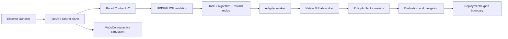

# Legged Studio architecture

Legged Studio is a local control plane for contract-driven legged-robot
training and simulation. The desktop launcher is deliberately thin: opening
it is read-only, while **Start control plane** prepares the workspace, checks
or installs control-plane dependencies, starts the backend, and opens the Web
Workbench.

## Product loop



## Boundaries

| Layer | Responsibility | Current status |
| --- | --- | --- |
| Desktop/Web | Lifecycle, forms, logs, plots, workflow navigation | Implemented for local control plane |
| Contract store | Versioned robot, scenario, recipe, and policy metadata | Robot Contract v2 and PolicyArtifact are implemented; Scenario Contract is the next extension |
| Registry | Discover algorithms, rewards, maps, and task options | PPO is exposed for native MJLab training; SAC/TD3 remain registered for future native implementations |
| Recipe registry | Resolve task, algorithm, terrain, commands, and reward scales into one reproducible payload | `adapters/mjlab/recipe_registry.py` and `/api/training/resolve-recipe` implemented |
| Scenario Contract | Version map, waypoints, command limits, seed, and metrics | `contracts/scenario_contract.py` and `/api/scenarios/validate` implemented |
| Simulation adapter | Interactive MuJoCo sessions for basic teleoperation and map stepping | Available through `/api/simulation`; this is simulation only, never a training backend |
| Native MJLab adapter | External MJLab source with the unified `adapters/mjlab` worker | The only training backend; Go2/ZEX-W training, evaluation, and navigation use the isolated worker |
| Navigation planner | Waypoints, manual commands, locomotion policy replay | Waypoint replay API implemented; pure-pursuit/recovery state machine is a Phase 2 enhancement |
| Artifact/export | Checkpoints, manifest, ONNX/deployment mapping | Manifest/checkpoint path exists; hardware-specific export remains an explicit boundary |

## One contract, two entry points

The Web Workbench and `scripts/legged_studio_cli.py` call the same HTTP routes.
This keeps validation, algorithm selection, reward toggles, training status,
simulation sessions, and navigation results consistent. A future CLI can add
batching and CI output without reimplementing training semantics.

Useful commands:

```powershell
python scripts/legged_studio_cli.py algorithms
python scripts/legged_studio_cli.py validate-contract examples/go2_example_contract.json
python scripts/legged_studio_cli.py maps
python scripts/legged_studio_cli.py simulate --map flat --steps 10 --vx 0.3
```

## Runtime and dependency policy

The control plane should remain importable with FastAPI, Uvicorn, and Pydantic.
MuJoCo is used by the interactive simulation and MJLab runtime; PyTorch, Warp,
RSL-RL, and native MJLab are loaded only by the isolated training worker. The
desktop launcher does not install or start anything on open. Configuration is
an explicit action after the user clicks the start button.

## Verification levels

- **Verified**: API health, model and Contract validation, and MuJoCo session lifecycle for interactive simulation.
- **Verified**: native MJLab manager-based Go2/ZEX-W training, CUDA selection, evaluation, and waypoint navigation in the isolated worker. `/api/adapters/status` reports source readiness without importing the native stack into the control plane.
- **Candidate**: packaged native-runtime provisioning and Viser/Three.js rich simulation rendering.
- **Phase 2/3**: waypoint-conditioned planner, scenario persistence, ONNX numerical replay gates, and hardware deployment.
